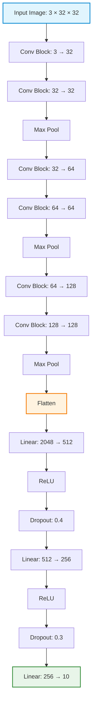

# Image Classification with PyTorch & FastAPI


A production-style Image Classification project built with **PyTorch** and **FastAPI** using the **CIFAR-10** dataset.

The project demonstrates a complete deep learning workflow from dataset preparation to deployment through a REST API.

## Features

* Clean and modular project architecture
* Custom CNN for CIFAR-10
* Data augmentation with TorchVision
* Training and validation pipeline
* Accuracy, Precision, Recall, and F1-score
* Classification report and confusion matrix
* Checkpoint saving and loading
* Training history visualization
* Image inference
* FastAPI REST API
* Structured logging
* Unit testing with Pytest
* Type hints and documentation
* Easy to extend with pretrained models

---

## Project Structure

```text
Image-Classification/
│
├── app/
│   ├── main.py
│   └── schemas.py
│
├── checkpoints/
│
├── data/
│
├── images/
│
├── logs/
│   ├── app.log
│   ├── access.log
│   ├── error.log
│   └── inference.log
│
├── outputs/
│
├── src/
│   ├── config.py
│   ├── dataset.py
│   ├── engine.py
│   ├── evaluate.py
│   ├── inference.py
│   ├── logger.py
│   ├── metrics.py
│   ├── model.py
│   ├── train.py
│   └── utils.py
│
├── tests/
│
├── pytest.ini
├── requirements.txt
└── README.md

```

---

## Dataset

This project uses the **CIFAR-10** dataset.

**Classes**

* airplane
* automobile
* bird
* cat
* deer
* dog
* frog
* horse
* ship
* truck

### Dataset Statistics

* Training Images: **50,000**
* Test Images: **10,000**
* Image Size: **32 × 32**
* Number of Classes: **10**

---

## Model Summary

| Property | Value |
| --- | --- |
| Dataset | CIFAR-10 |
| Input Size | 3 × 32 × 32 |
| Number of Classes | 10 |
| Architecture | Custom CNN |
| Activation | ReLU |
| Batch Normalization | ✅ |
| Dropout | ✅ |
| Optimizer | Adam |
| Loss Function | CrossEntropyLoss |
| LR Scheduler | StepLR |
| Trainable Parameters | **1,470,442** |

---

## Model Architecture



---

## Train the Model

```bash
python -m src.train

```

Training automatically:

* Downloads the dataset (first run only)
* Trains the CNN
* Validates after every epoch
* Saves the best checkpoint
* Generates loss and accuracy plots

Saved checkpoint:

```text
checkpoints/
└── best_model.pth

```

---

## Evaluate the Model

```bash
python -m src.evaluate

```

Evaluation includes:

* Test Loss
* Accuracy
* Precision
* Recall
* F1-score
* Classification Report
* Confusion Matrix
* Normalized Confusion Matrix

Generated outputs:

```text
outputs/
├── loss_curve.png
├── acc_curve.png
├── confusion_matrix.png
└── normalized_confusion_matrix.png

```

---

## Run Inference

```bash
python -m src.inference

```

Example output:

```python
{
    "class_name": "dog",
    "confidence": 0.9873
}

```

---

## Run FastAPI Server

```bash
uvicorn app.main:app --reload

```

Open:

```text
[http://127.0.0.1:8000/docs](http://127.0.0.1:8000/docs)

```

Example response:

```json
{
    "class_name": "cat",
    "confidence": 0.9968
}

```

---

## Testing

Run all tests:

```bash
pytest

```

Run with coverage:

```bash
pytest --cov=src

```

Generate HTML coverage:

```bash
pytest --cov=src --cov-report=html

```

---

## Logging

The application automatically creates log files inside the `logs/` directory.

```text
logs/
├── app.log
├── access.log
├── error.log
└── inference.log

```

---

## Project Workflow


---

## Results

### Training Loss

### Training Accuracy

### Confusion Matrix

### Normalized Confusion Matrix

---

## Technologies Used

* Python
* PyTorch
* TorchVision
* FastAPI
* Uvicorn
* Pydantic
* NumPy
* Matplotlib
* Pillow
* Scikit-learn
* Pytest
* tqdm

---

## Future Improvements

* Transfer Learning (ResNet, EfficientNet, ConvNeXt)
* Vision Transformer (ViT)
* Mixed Precision Training (AMP)
* TensorBoard Integration
* Early Stopping
* Learning Rate Warmup
* Docker Support
* GitHub Actions CI/CD
* MLflow Experiment Tracking
* Batch Inference API
* ONNX Export
* TorchScript Deployment

---

## License

This project is released under the MIT License.

---

## Acknowledgements

* PyTorch
* TorchVision
* FastAPI
* CIFAR-10 Dataset
